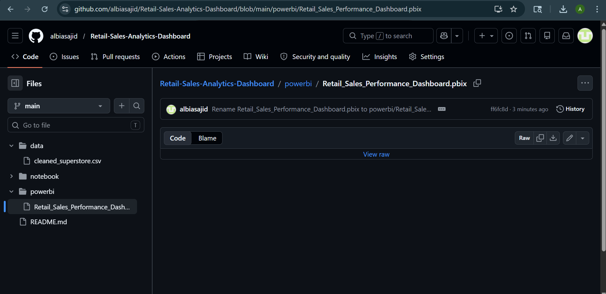

# 📊 Retail Sales Analytics Dashboard

### Business Intelligence using Python & Power BI

---

## 📌 Project Overview

This project analyzes retail sales data to uncover key business insights using Python (Pandas, Matplotlib) and Power BI. The goal is to identify sales patterns, profitability issues, and provide actionable business recommendations.

---

## 🛠 Tools & Technologies

* Python (Pandas, NumPy, Matplotlib)
* Jupyter Notebook
* Power BI
* Data Cleaning & Visualization

---

## 📂 Project Structure

* `data/` → Cleaned dataset
* `notebook/` → Data analysis in Python
* `powerbi/` → Interactive dashboard
* `images/` → Dashboard preview

---

## 📊 Dashboard Preview

---

## 🔍 Key Insights

* Technology category generates highest profit
* Furniture category contributes to losses
* Some sub-categories like Tables and Bookcases are loss-making
* West region performs best in sales and profit
* Sales show seasonal trends over time

---

## 💡 Business Recommendations

* Reduce discounts on loss-making products
* Focus on high-profit categories like Technology
* Improve pricing strategy in Furniture
* Optimize underperforming regions
* Use seasonal trends for better planning

---

## 📁 Files Included

* `Sales_Analysis.ipynb` → Python analysis
* `cleaned_superstore.csv` → Clean dataset
* `Retail_Sales_Performance_Dashboard.pbix` → Power BI dashboard

---

## 🚀 Conclusion

This project demonstrates how data analysis and visualization can help businesses make informed decisions and improve profitability.

---

